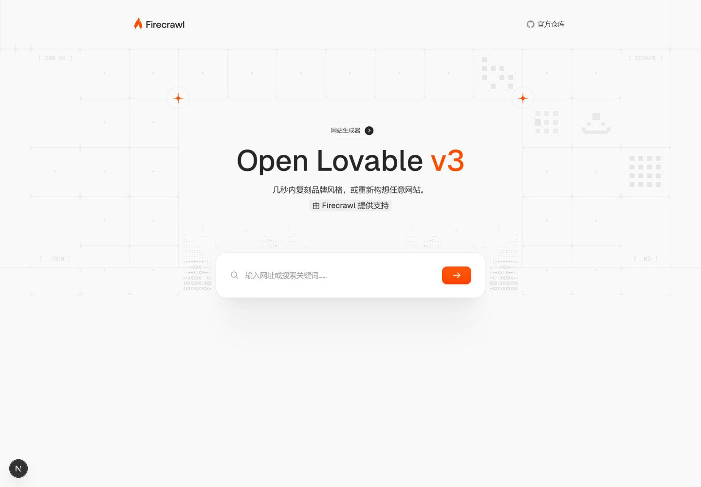

# Open Lovable 简体中文社区版

> [!IMPORTANT]
> 这是基于 [Firecrawl Open Lovable](https://github.com/firecrawl/open-lovable) 的非官方简体中文社区版本，不由 Firecrawl 官方维护或背书。当前代码基于上游提交 [`69bd93b`](https://github.com/firecrawl/open-lovable/commit/69bd93bae7a9c97ef989eb70aabe6797fb3dac89)。

使用 AI 抓取并分析目标网站，在隔离沙箱中生成可预览、可继续修改、可下载的 React 应用。



## 社区版内容

- 首页、风格选择、生成工作区、进度、错误、下载提示和品牌规范面板已完成简体中文化。
- 静态文案已集中到 `locales/en.ts` 与 `locales/zh-CN.ts`，两种语言共享 TypeScript 结构约束。
- 内部流程状态、API 字段、服务端日志和 AI 技术提示词保持英文，最终展示时再翻译，避免破坏程序判断。
- Firecrawl 抓取接口已适配 v2，并避免使用部分账户或地区不支持的 actions。
- 支持 E2B 与 Vercel Sandbox，以及自定义 `OPENAI_BASE_URL` 的 OpenAI 兼容服务。
- `OPENAI_API_MODE=chat` 可用于仅实现 Chat Completions 的第三方服务。

## 运行前提

- Node.js 20.9 或更高版本，CI 使用 Node.js 22
- pnpm 10 或更高版本，仓库锁定版本为 pnpm 11.16.0
- Firecrawl API Key
- E2B 或 Vercel Sandbox 凭据
- 至少一个受支持的模型服务凭据

Firecrawl、沙箱和模型 API 通常按量计费。请先阅读各服务的价格、额度和数据处理条款。

## 快速开始

```bash
git clone <你的仓库地址>
cd open-lovable-zh-CN
pnpm install --frozen-lockfile
cp .env.example .env.local
pnpm dev
```

Windows PowerShell 可使用：

```powershell
Copy-Item .env.example .env.local
pnpm dev
```

打开 [http://localhost:3000](http://localhost:3000)。不要提交 `.env.local`。

## 环境配置

最小 E2B 与 OpenAI 兼容服务示例：

```env
FIRECRAWL_API_KEY=your_firecrawl_api_key
SANDBOX_PROVIDER=e2b
E2B_API_KEY=your_e2b_api_key

OPENAI_API_KEY=your_openai_or_provider_key
OPENAI_BASE_URL=https://your-provider.example/v1
OPENAI_API_MODE=chat
NEXT_PUBLIC_DEFAULT_MODEL=openai/your-model-id
NEXT_PUBLIC_APP_URL=http://localhost:3000
```

`OPENAI_API_MODE=chat` 仅在服务商不支持 Responses API 时启用。OpenAI 兼容接口在模型 ID、流式响应、tool call 和错误格式上可能存在差异，本项目只提供兼容入口，不承诺支持所有第三方服务。

使用 Vercel Sandbox 时，将 `SANDBOX_PROVIDER` 改为 `vercel`，再通过 `vercel link` 与 `vercel env pull` 获取 OIDC 配置，或按 [.env.example](.env.example) 配置团队、项目与个人令牌。两种鉴权方式选择一种即可。

其他可选模型服务、base URL 和 Morph 配置均记录在 [.env.example](.env.example)。浏览器可读取的变量必须使用 `NEXT_PUBLIC_` 前缀，因此不要把任何密钥放入这类变量。

## 常用命令

```bash
pnpm dev        # 本地开发
pnpm lint       # ESLint，零警告策略
pnpm typecheck  # TypeScript 类型检查
pnpm check      # lint + typecheck
pnpm build      # 生产构建
pnpm start      # 启动生产构建
```

开发服务和生产构建共用 `.next`。请先停止 `pnpm dev`，再执行 `pnpm build`。

## 部署安全

本项目默认是本地开发工具，不包含用户登录、API 配额、请求限流或租户隔离。直接部署到公网会让访问者通过你的服务端密钥消耗 Firecrawl、沙箱和模型额度。公开部署前至少应增加身份验证、速率限制、请求大小限制、使用量监控和费用告警。

不要在 Issue、截图、日志或生成的 ZIP 中提交 API Key、私人端点、带鉴权参数的 URL 或用户数据。更多说明见 [SECURITY.md](SECURITY.md)。

## 汉化与已知限制

- 当前版本固定显示简体中文，尚未提供运行时语言切换器。
- 生成内容、代码、命令输出、模型名称和第三方服务返回的未知错误可能保留英文。
- 动态状态仍有一部分通过兼容映射翻译；新增状态应优先使用稳定状态码和参数。
- 端到端生成依赖付费外部服务，CI 只执行静态检查和生产构建。

新增文案时请同时更新 `locales/en.ts` 与 `locales/zh-CN.ts`。不要直接翻译 API payload、模型 ID 或发送给模型的技术提示词。

## 贡献与上游同步

提交 Issue 或 PR 前请阅读 [CONTRIBUTING.md](CONTRIBUTING.md)。社区版每次发布都应记录对应的上游 commit；同步时重点复验 Firecrawl 请求、模型 provider、沙箱创建与 ID 传递、预览、下载和中文文案。

通用修复与语言基础设施应尽量拆成可独立审查的提交，便于回馈官方上游。社区专用模型配置和品牌说明不要混入上游 PR。

## 版本与许可

计划中的首个社区版标签为 `v3-zh.1`，变更记录见 [CHANGELOG.md](CHANGELOG.md)。发布检查项见 [docs/RELEASE_CHECKLIST.md](docs/RELEASE_CHECKLIST.md)。

本项目沿用上游 [MIT License](LICENSE)，并保留原作者版权与许可证文本。感谢 Firecrawl 团队和 Open Lovable 的所有贡献者。
